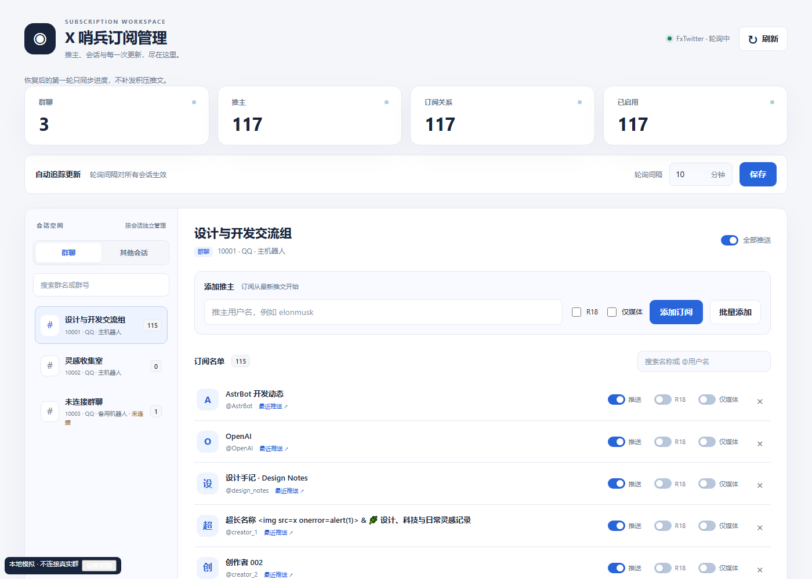

<div align="center">


# X 哨兵

把关注的 X / Twitter 更新送到 QQ，让恢复后的消息保持安静。

**订阅推送 · 恢复不补发 · 视频与动图 · 原插件数据继承**

[安装与迁移](#安装与迁移) · [防刷屏策略](#防刷屏策略) · [使用指令](#使用指令) · [常见问题](#常见问题)
</div>

X 哨兵是基于 [Ars1027/astrbot_plugin_twitter](https://github.com/Ars1027/astrbot_plugin_twitter) 的独立衍生插件。保留 Nitter / FxTwitter 双数据源、翻译、截图、合并转发和订阅管理页面，重点改进数据继承、恢复推送和媒体完整性。

适用于 **AstrBot 4.16 至 4.x、QQ / OneBot v11（`aiocqhttp`）**。订阅管理页面需要 AstrBot 支持 Plugin Pages；没有该功能时仍可使用聊天指令。其他消息平台未列为支持范围。

## 安装与迁移

在 AstrBot 插件管理中，从以下仓库安装：

```text
https://github.com/Whereis-Alice/astrbot_plugin_x_sentinel
```

### 已安装原 Twitter 插件

1. **先停用原插件，暂时不要卸载或清除其数据。** 安装 X 哨兵后，首次启动会在同一个 AstrBot 实例中读取原插件配置与订阅，并复制到自己的数据空间。
2. 打开 **X 哨兵 → 订阅管理**，或由 AstrBot 管理员发送 `/X哨兵状态`，确认显示“已完成”，并核对推主数量、订阅关系和目标会话。原来的暂停状态、R18/仅媒体设置、去重记录及最近推送记录都会保留。
3. 核对完成后再卸载原插件。X 哨兵首次检查每个推主时只建立当前进度；之后按正常间隔推送新内容。

如果安装时原插件仍处于启用状态，X 哨兵会先继承数据并**保持待命**，暂停自己的自动推送和自动链接解析。停用或卸载原插件后，最迟在下一轮检查时接管。手动测试和手动解析仍可以使用。

**迁移是一次性复制。** 原插件的数据不会被改写；X 哨兵保留迁移快照，卸载原插件后可独立运行。重复加载不会覆盖新设置，也不会把已经删除的订阅重新加回。请尽量在停用原插件后迁移；复制完成后再在原插件中作出的修改不会自动同步。

旧配置会导入到相同功能的设置中；新版防刷屏配额使用新版默认值。新插件里已经改成非默认值的选项优先保留。迁移失败时会暂停自动推送并记录日志，不会把失败当成“零订阅迁移成功”。

> 自动继承面向原插件标准标识 `ars1027/astrbot_plugin_twitter`，并兼容其分组配置与旧式顶层配置。跨服务器迁移需要先迁移 AstrBot 的数据和会话配置；仅复制原插件代码目录不包含订阅。请勿在确认前清除原插件数据。

### 全新安装

1. 配置可用的 Nitter 地址，或切换到 FxTwitter 数据源。
2. 在要接收推送的群聊或私聊中发送 `/X哨兵关注 用户名`。用户名填写 `@` 后面的部分，例如 `Kirby_JP`。
3. 使用 `/X哨兵测试 用户名` 手动查看一条推文，确认消息样式。自动轮询不会回填旧内容。

手动安装时，将仓库放到 `data/plugins/astrbot_plugin_x_sentinel`，并在 **AstrBot 使用的 Python 环境**执行 `pip install -r requirements.txt`，随后加载插件。

## 防刷屏策略

本插件面向“关注新动态”，**不承诺完整归档每一条推文**。以下规则会主动跳过内容，以防恢复后连续补发：

| 场景 | 自动推送行为 |
| --- | --- |
| 插件重载、重启或停用后重新启用 | 每个推主第一次成功读取时间线只同步进度，不发历史内容 |
| 数据源请求失败或检查长时间中断后恢复 | 先重新同步，再接收之后的新动态 |
| 正常轮询内出现大量新推文 | 默认每个推主只保留最新 1 条；更早内容直接跳过 |
| 多个推主同时更新 | 默认每个会话每轮最多接收 3 条推文；超过配额的不排队、不留到下一轮补发 |
| 某个会话发送失败 | 已成功的会话不因其他会话失败而反复重发；恢复策略会跳过迟到内容 |
| 停用或卸载插件 | 取消轮询并丢弃未发送的汇总缓存，不在退出时补发 |

配额按**推文条数**计算，不是底层消息条数：一条推文的正文、图片和视频可能分别发送。想合并正文可开启“集体转发”；视频仍需独立发送。手动测试、解析不受自动轮询配额限制。

## 视频与 GIF

- 支持 Nitter 视频/GIF 容器，以及 FxTwitter 的 `video`、`gif`、`animated_gif` 媒体数据。
- Twitter 动图通常以 **MP4** 形式提供，因此以短视频发送；是否自动循环由 QQ 客户端决定。
- 同一个视频的多个清晰度只选取一个可用源，避免重复发送。
- 无法直发、大小未知、超过大小上限、只有 HLS 流或数据源缺少媒体地址时，尽量保留媒体链接或原帖链接和说明，不静默吞掉视频。
- Nitter 未提供可发送视频时会尝试用已配置的 FxTwitter API 补全；第三方服务不可用时仍会保留已有正文。
- “单独发送推文媒体资源”关闭时，不再追加原图、视频或媒体降级链接；截图中的预览仍会显示。

视频最终由 QQ 协议端下载与上传；插件的代理预下载开关用于图片和封面，**不能替代协议端的视频网络配置**。截图渲染失败会自动改发文字，不影响继续轮询。

## 使用指令

命令前缀以下以 `/` 举例，请以 AstrBot 的实际设置为准。所有命令都使用独立前缀，不注册原插件的 `/推特…`、`twitter_…` 别名。

| 指令 | 作用 |
| --- | --- |
| `/X哨兵关注 用户名 [r18] [媒体]` | 当前会话订阅；`r18` 允许敏感内容，`媒体` 仅推送含媒体的推文 |
| `/X哨兵批量关注 用户名1 用户名2 [r18] [媒体]` | 批量订阅 |
| `/X哨兵取关 用户名` | 移除当前会话的订阅 |
| `/X哨兵批量取关 用户名1 用户名2` | 批量移除 |
| `/X哨兵列表` | 查看当前会话的订阅 |
| `/X哨兵推送 开启` / `/X哨兵推送 关闭` | 开关当前会话全部订阅的推送 |
| `/X哨兵测试 用户名` | 手动查看一条最新符合条件的推文 |
| `/X哨兵解析 推文链接` | 手动解析 `x.com` / `twitter.com` 帖子链接 |
| `/X哨兵状态` | 管理员查看迁移、待命与轮询状态 |
| `/X哨兵清空订阅` | 管理员操作；按提示确认后清空**所有会话**的订阅 |

英文别名：`xsentinel_follow`、`xsentinel_batch_follow`、`xsentinel_unfollow`、`xsentinel_batch_unfollow`、`xsentinel_list`、`xsentinel_push`、`xsentinel_test`、`xsentinel_parse`、`xsentinel_status`、`xsentinel_clear_all`。

修改订阅的指令默认作用于当前会话。管理员可在 AstrBot 指令管理中限制其权限；订阅管理页面由 Dashboard 登录权限保护。

## 订阅管理页面

从 AstrBot Dashboard 打开 **X 哨兵 → X 哨兵订阅管理**。支持搜索群聊、批量关注、修改推送/敏感内容/仅媒体选项、群级暂停、调整全局轮询间隔，以及查看最近实际推送的摘要。迁移结果与共存待命状态显示在页面上方。



## 主要设置

配置按功能分组，保留原有功能的配置键以便迁移；这些键位于新插件的独立配置文件中，不会与原插件共享。

| 设置 | 默认值 | 建议 |
| --- | --- | --- |
| 数据源 | Nitter | 自建 Nitter 可填内网地址；FxTwitter 的部分公开实例不提供用户时间线 |
| 轮询间隔 | 5 分钟 | 建议至少 3 分钟，留意第三方限流 |
| 每推主每轮数量 | 1 | 超出部分跳过，不补发 |
| 每会话每轮数量 | 3 | 包括所有订阅推主的更新 |
| 中断检查间隔 | 15 分钟 | 超时恢复先同步；实际阈值不低于轮询间隔的 3 倍 |
| 单条合并转发 | 开启 | 普通消息可关闭；集体转发需同时开启此项 |
| 正文样式 | 文字 | 可选深色/浅色截图，需可用的 AstrBot 渲染服务 |
| 视频大小上限 | 256 MB | 大文件改为链接；仍受 QQ 协议端限制 |
| 链接解析 | 自动 | 可选关闭或仅指令；关闭时手动解析也不可用 |
| 翻译 | 关闭 | 选择 AstrBot 已配置的 LLM Provider；超时回退原文 |
| 自动继承旧数据 | 开启 | 无旧插件时不影响全新使用 |

翻译正文与引用共用超时预算；连续失败时本轮后续内容使用原文。头像使用有界本地缓存；媒体下载有大小和时间限制。

## 常见问题

**刚迁移成功，为什么没有补发之前漏掉的推文？**

这是默认防刷屏行为。首次同步和恢复同步会跳过旧内容。需要查看时，使用手动测试或解析具体链接。

**显示待命，什么时候开始推送？**

原插件仍启用。停用或卸载原插件后，新插件会在下一轮接管；首次检查只同步进度。原插件卸载不会删除 X 哨兵的数据。

**FxTwitter 可以解析链接，却不能订阅？**

推文详情与用户时间线是不同接口。部分公开实例仅支持详情，切换到支持时间线的服务或使用 Nitter。健康检查和请求失败会记录日志，不会把失败当作空时间线。

**收到正文但只有视频链接？**

源站可能只提供 HLS、无法探测大小、超过上限，或协议端无法下载/上传。链接是预期降级结果。确认媒体发送开关已启用，并检查 AstrBot 与 QQ 协议端的网络。

**可以回退到原插件吗？**

可以。先停用 X 哨兵，再启用原插件；旧数据未被改写。但 X 哨兵中的后续修改不会同步回旧插件，原插件仍可能补发它自己的积压。

## 开发与许可

本项目继承上游代码，遵循仓库 [AGPL-3.0](./LICENSE)，保留原作者 Ars1027 的贡献说明。新版改动、迁移逻辑与 Logo 由 Whereis-Alice 维护。X/Twitter 与本项目无隶属关系。

验证命令：

```bash
python -m pytest -q
python -m ruff check main.py twitter_api.py twitter_renderer.py twitter_webui.py services tests
python -m compileall -q main.py twitter_api.py twitter_renderer.py twitter_webui.py services
node --test tests/test_webui_batch.mjs
git diff --check
```

本地预览管理页面：`python tests/webui_preview.py`；预览使用模拟数据。
